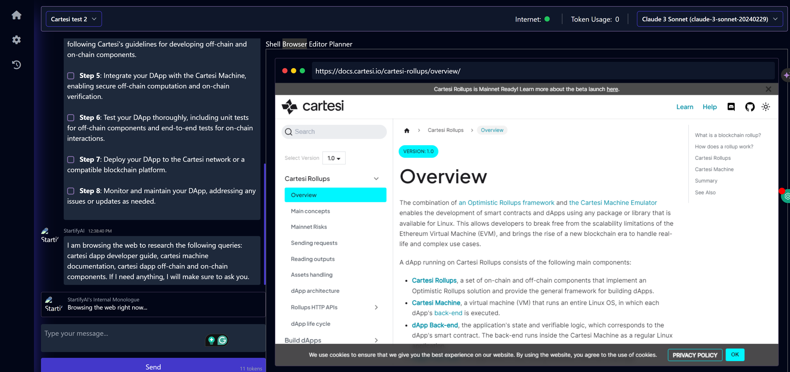

<p align="center">
  
</p>

<h1 align="center">🚀 StartifyAI - Agentic AI Software Engineer 👩‍💻</h1>



> [!IMPORTANT]  
> This project is currently in a very early development/experimental stage. There are a lot of unimplemented/broken features at the moment. Contributions are welcome to help out with the progress!

## Table of Contents

- [About](#about)
- [Key Features](#key-features)
- [System Architecture](#system-architecture)
- [Quick Start](#quick-start)
- [Installation](#installation)
- [Getting Started](#getting-started)
- [Configuration](#configuration)
- [Under The Hood](#under-the-hood)
  - [AI Planning and Reasoning](#ai-planning-and-reasoning)
  - [Keyword Extraction](#keyword-extraction)
  - [Browser Interaction](#browser-interaction)
  - [Code Writing](#code-writing)
- [Contributing](#contributing)
- [License](#license)

## About

StartifyAI is an advanced AI software engineer that can understand high-level human instructions, break them down into steps, research relevant information, and write code to achieve the given objective. StartifyAI utilizes large language models, planning and reasoning algorithms, and web browsing abilities to intelligently develop software.

StartifyAI aims to revolutionize the way we build software by providing an AI pair programmer who can take on complex coding tasks with minimal human guidance. Whether you need to create a new feature, fix a bug, or develop an entire project from scratch, StartifyAI is here to assist you.

> [!NOTE]
> StartifyAI is modeled after [Devin](https://www.cognition-labs.com/introducing-devin) by Cognition AI. This project aims to be an open-source alternative to Devin with an "overly ambitious" goal to meet the same score as Devin in the [SWE-bench](https://www.swebench.com/) Benchmarks... and eventually beat it?


## Key Features

- 🤖 Supports **Claude 3**, **GPT-4**, **GPT-3.5**, and **Local LLMs** via [Ollama](https://ollama.com). For optimal performance: Use the **Claude 3** family of models.
- 🧠 Advanced AI planning and reasoning capabilities
- 🔍 Contextual keyword extraction for focused research
- 🌐 Seamless web browsing and information gathering
- 💻 Code writing in multiple programming languages
- 📊 Dynamic agent state tracking and visualization
- 💬 Natural language interaction via chat interface
- 📂 Project-based organization and management
- 🔌 Extensible architecture for adding new features and integrations

## System Architecture

StartifyAI's system architecture consists of the following key components:

1. **User Interface**: A web-based chat interface for interacting with StartifyAI, viewing project files, and monitoring the agent's state.
2. **Agent Core**: The central component that orchestrates the AI planning, reasoning, and execution process. It communicates with various sub-agents and modules to accomplish tasks.
3. **Large Language Models**: StartifyAI leverages state-of-the-art language models like **Claude**, **GPT-4**, and **Local LLMs via Ollama** for natural language understanding, generation, and reasoning.
4. **Planning and Reasoning Engine**: Responsible for breaking down high-level objectives into actionable steps and making decisions based on the current context.
5. **Research Module**: Utilizes keyword extraction and web browsing capabilities to gather relevant information for the task at hand.
6. **Code Writing Module**: Generates code based on the plan, research findings, and user requirements. Supports multiple programming languages.
7. **Browser Interaction Module**: Enables StartifyAI to navigate websites, extract information, and interact with web elements as needed.
8. **Knowledge Base**: Stores and retrieves project-specific information, code snippets, and learned knowledge for efficient access.
9. **Database**: Persists project data, agent states, and configuration settings.

Read [**ARCHITECTURE.md**](https://github.com/AI-Uplift/StartifyAI/blob/main/ARCHITECTURE.md) for the detailed documentation.

## Quick Start

The easiest way to run the project locally:

1. Install `uv` - Python Package manager (https://github.com/astral-sh/uv)
2. Install `bun` - JavaScript runtime (https://bun.sh/)
3. Install and setup `Ollama` (https://ollama.com/)

Set the API Keys in the `config.toml` file. (This will soon be moving to the UI where you can set these keys from the UI itself without touching the command-line, want to implement it? See this issue: https://github.com/stitionai/StartifyAI/issues/3)

Then execute the following set of command:

```
ollama serve
git clone https://github.com/stitionai/StartifyAI.git
cd StartifyAI/
uv venv
uv pip install -r requirements.txt
cd ui/
bun install
bun run dev
python3 StartifyAI.py
```

Docker images will be released soon. :raised_hands:

## Installation
StartifyAI requires the following things as dependencies:
- Ollama (follow the instructions here to install it: [https://ollama.com/](https://ollama.com/))
- Bun (follow the instructions here to install it: [https://bun.sh/](https://bun.sh/))

To install StartifyAI, follow these steps:

1. Clone the StartifyAI repository:
   ```bash
   git clone https://github.com/AI-Uplift/StartifyAI.git
   ```
2. Navigate to the project directory:
   ```bash
   cd StartifyAI
   ```
3. Install the required dependencies:
   ```bash
   pip install -r requirements.txt
   playwright install --with-deps # installs browsers in playwright (and their deps) if required
   ```
4. Set up the necessary API keys and configuration (see [Configuration](#configuration) section).
5. Start the StartifyAI server:
   ```bash
   python StartifyAI.py
   ```
6. Compile and run the UI server:
   ```bash
   cd ui/
   bun install
   bun run dev
   ```
7. Access the StartifyAI web interface by opening a browser and navigating to `http://127.0.0.1:3000`.

## Getting Started

To start using StartifyAI, follow these steps:

1. Open the StartifyAI web interface in your browser.
2. Create a new project by clicking on the "New Project" button and providing a name for your project.
3. Select the desired programming language and model configuration for your project.
4. In the chat interface, provide a high-level objective or task description for StartifyAI to work on.
5. StartifyAI will process your request, break it down into steps, and start working on the task.
6. Monitor StartifyAI's progress, view generated code, and provide additional guidance or feedback as needed.
7. Once StartifyAI completes the task, review the generated code and project files.
8. Iterate and refine the project as desired by providing further instructions or modifications.

## Configuration

StartifyAI requires certain configuration settings and API keys to function properly. Update the `config.toml` file with the following information:

- `OPENAI_API_KEY`: Your OpenAI API key for accessing GPT models.
- `CLAUDE_API_KEY`: Your Anthropic API key for accessing Claude models.
- `BING_API_KEY`: Your Bing Search API key for web searching capabilities.
- `DATABASE_URL`: The URL for your database connection.
- `LOG_DIRECTORY`: The directory where StartifyAI's logs will be stored.
- `PROJECT_DIRECTORY`: The directory where StartifyAI's projects will be stored.

Make sure to keep your API keys secure and do not share them publicly.

## Under The Hood

Let's dive deeper into some of the key components and techniques used in StartifyAI:

### AI Planning and Reasoning

StartifyAI employs advanced AI planning and reasoning algorithms to break down high-level objectives into actionable steps. The planning process involves the following stages:

1. **Objective Understanding**: StartifyAI analyzes the given objective or task description to understand the user's intent and requirements.
2. **Context Gathering**: Relevant context is collected from the conversation history, project files, and knowledge base to inform the planning process.
3. **Step Generation**: Based on the objective and context, StartifyAI generates a sequence of high-level steps to accomplish the task.
4. **Refinement and Validation**: The generated steps are refined and validated to ensure their feasibility and alignment with the objective.
5. **Execution**: StartifyAI executes each step in the plan, utilizing various sub-agents and modules as needed.

The reasoning engine constantly evaluates the progress and makes adjustments to the plan based on new information or feedback received during execution.

### Keyword Extraction

To enable focused research and information gathering, StartifyAI employs keyword extraction techniques. The process involves the following steps:

1. **Preprocessing**: The input text (objective, conversation history, or project files) is preprocessed by removing stop words, tokenizing, and normalizing the text.
2. **Keyword Identification**: StartifyAI uses the BERT (Bidirectional Encoder Representations from Transformers) model to identify important keywords and phrases from the preprocessed text. BERT's pre-training on a large corpus allows it to capture semantic relationships and understand the significance of words in the given context.
3. **Keyword Ranking**: The identified keywords are ranked based on their relevance and importance to the task at hand. Techniques like TF-IDF (Term Frequency-Inverse Document Frequency) and TextRank are used to assign scores to each keyword.
4. **Keyword Selection**: The top-ranked keywords are selected as the most relevant and informative for the current context. These keywords are used to guide the research and information gathering process.

By extracting contextually relevant keywords, StartifyAI can focus its research efforts and retrieve pertinent information to assist in the task completion.

### Browser Interaction

StartifyAI incorporates browser interaction capabilities to navigate websites, extract information, and interact with web elements. The browser interaction module leverages the Playwright library to automate web interactions. The process involves the following steps:

1. **Navigation**: StartifyAI uses Playwright to navigate to specific URLs or perform searches based on the keywords or requirements provided.
2. **Element Interaction**: Playwright allows StartifyAI to interact with web elements such as clicking buttons, filling forms, and extracting text from specific elements.
3. **Page Parsing**: StartifyAI parses the HTML structure of the web pages visited to extract relevant information. It uses techniques like CSS selectors and XPath to locate and extract specific data points.
4. **JavaScript Execution**: Playwright enables StartifyAI to execute JavaScript code within the browser context, allowing for dynamic interactions and data retrieval.
5. **Screenshot Capture**: StartifyAI can capture screenshots of the web pages visited, which can be useful for visual reference or debugging purposes.

The browser interaction module empowers StartifyAI to gather information from the web, interact with online resources, and incorporate real-time data into its decision-making and code generation processes.

### Code Writing

StartifyAI's code writing module generates code based on the plan, research findings, and user requirements. The process involves the following steps:

1. **Language Selection**: StartifyAI identifies the programming language specified by the user or infers it based on the project context.
2. **Code Structure Generation**: Based on the plan and language-specific patterns, StartifyAI generates the high-level structure of the code, including classes, functions, and modules.
3. **Code Population**: StartifyAI fills in the code structure with specific logic, algorithms, and data manipulation statements. It leverages the research findings, code snippets from the knowledge base, and its own understanding of programming concepts to generate meaningful code.
4. **Code Formatting**: The generated code is formatted according to the language-specific conventions and best practices to ensure readability and maintainability.
5. **Code Review and Refinement**: StartifyAI reviews the generated code for syntax errors, logical inconsistencies, and potential improvements. It iteratively refines the code based on its own analysis and any feedback provided by the user.

StartifyAI's code writing capabilities enable it to generate functional and efficient code in various programming languages, taking into account the specific requirements and context of each project.

## Contributing

We welcome contributions to enhance StartifyAI's capabilities and improve its performance. To contribute, please follow these steps:

1. Fork the StartifyAI repository on GitHub.
2. Create a new branch for your feature or bug fix.
3. Make your changes and ensure that the code passes all tests.
4. Submit a pull request describing your changes and their benefits.

Please adhere to the coding conventions, maintain clear documentation, and provide thorough testing for your contributions.

## License

StartifyAI is released under the [MIT License](https://opensource.org/licenses/MIT). See the `LICENSE` file for more information.

---

We hope you find StartifyAI to be a valuable tool in your software development journey. If you have any questions, feedback, or suggestions, please don't hesitate to reach out. Happy coding with StartifyAI!
